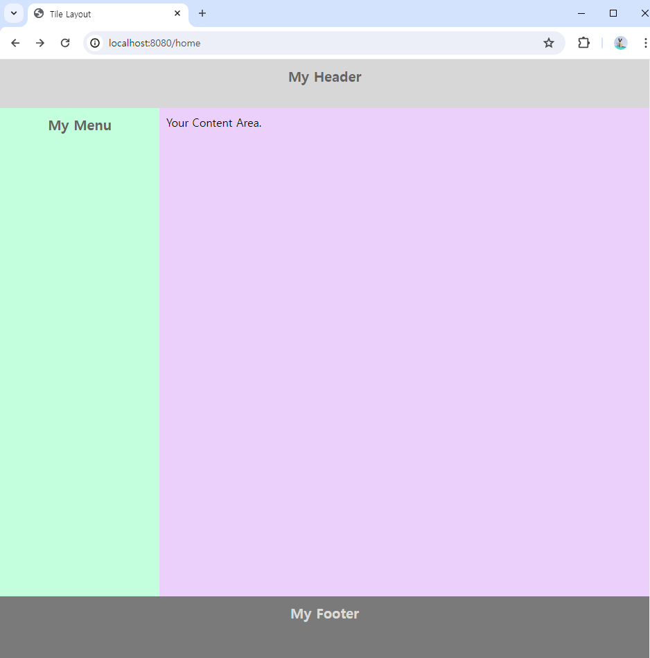

# Apache Tiles

## Tiles란?
하나의 웹 사이트에 접속해보세요.<br/>
그리고 사이트에 있는 메뉴들을 클릭해보세요.<br/>
페이지를 이동할 때마다 공통점과 차이점이 느껴지나요?

메뉴에 따라 페이지가 변경되고 있지만...<br/>
사이트의 로고가 나오는 <strong>`헤더(Header)`</strong>,<br/>
사이트의 부가적인 정보가 출력되는 <strong>`푸터(Footer)`</strong>,<br/>
그리고 사용자의 권한에 따라 보여주는 <strong>`메뉴바(Menu-bar)` 혹은 `네비게이터(Navigator)`</strong> 등<br/>
변경되지 않는 부분도 있죠!

이 변경되지 않는 부분들은 각 페이지를 작성할 때 어떻게 할까요?<br/>
페이지를 작성할 때마다 헤더와 푸터, 메뉴바(네비게이터)를 넣는걸까요?<br/>

### 아닙니다!

헤더와 푸터, 메뉴바(네비게이터)는 한 번만 작성하고,<br/>
모든 페이지에 적용이 되도록 설정하면 되요.<br/>

이러한 기능을 제공하는 것이 바로 <span style="font-size:25px; font-weight:bold; color:orange;">Tiles</span>에요.

전통적인 웹 사이트 구조는 아래 이미지와 비슷할거에요.



- `Header`(My Header) : 웹 사이트의 로고, 메뉴, 로그인한 사용자 정보 등이 출력되는 영역
- `Menu` or `Navigator`(My Menu) : 주로 로그인한 사용자에게 제공하는 메뉴들이 출력되는 영역 - ***이 영역은 없을 수도 있어요***
- `Content`(Your Content Area) : 메뉴 선택에 따라 데이터가 나타나는 영역
- `Footer`(My Footer) : 웹 사이트의 저작권 정보, 기업 정보 등 부가적인 정보가 출력되는 영역

Tiles를 적용하면 Header, Menu(Navigator), Footer를 한 번만 작성하여 재사용할 수 있어요.<br/>
즉, 선택된 메뉴에 상관없이 변경되지 않고 사용자에게 제공된다는 의미에요.

***그럼 Tiles를 왜 사용할까요?***

첫 번째는 `재사용성`이에요.<br/>
앞서 말했듯이 한 번만 작성하면 어디서든 적용하여 쓸 수 있어요.

두 번째는 페이지의 `일관성`이에요.<br/>
메뉴 선택에 따라 사용자에게 제공되는 정보가 다르고<br/>
제공되는 정보에 따라 화면의 모양이 달라질 수 있어요.<br/>
하지만 Tiles가 구조를 잡아준다면 `Content` 영역만 변경되겠죠?<br/>
그럼 모든 페이지를 일관된 구조로 작성할 수 있어요.

## Tiles License
- [Apache Tiles License 사이트 바로가기](https://tiles.apache.org/framework/license.html)

Tiles는 `Apache Software 재단`에서 만든 오픈소스에요.<br/>
그렇기 때문에 당연히 Apache License를 사용합니다.<br/>
정확히 말하면 Tiles는 `The Apache Software License, Version 2.0`을 사용하고 있는데<br/>
라이선스의 내용에 대해 자세히 알고싶다면 위에 작성한 'Apache Tiles License 사이트 바로가기'를 통해 확인해주세요.


## Tiles 구성 방법
Tiles의 구성방법은 Springframework를 기준으로 알아보도록 할게요.
### 1. pom.xml
- Tiles를 적용하기 위한 Dependency를 추가해줍니다.
``` xml
<!-- Tiles dependencies - 원하는 버전이 있다면 Repository에서 찾아주세요. -->
<dependency>
    <groupId>org.apache.tiles</groupId>
    <artifactId>tiles-extras</artifactId>
    <version>3.0.8</version>
</dependency>

<dependency>
    <groupId>org.apache.tiles</groupId>
    <artifactId>tiles-servlet</artifactId>
    <version>3.0.8</version>
</dependency>

<dependency>
    <groupId>org.apache.tiles</groupId>
    <artifactId>tiles-jsp</artifactId>
    <version>3.0.8</version>
</dependency>
```

### 2. tiles.xml
- Tiles의 구조를 작성하기 위한 Layout을 정의하고
- URL별로 Content 영역에 출력할 View(JSP) 파일의 경로를 정의합니다.
```xml
<?xml version="1.0" encoding="UTF-8"?>
<!DOCTYPE tiles-definitions PUBLIC "-//Apache Software Foundation//DTD Tiles Configuration 3.0//EN" "http://tiles.apache.org/dtds/tiles-config_3_0.dtd">

<tiles-definitions>
	<definition name="layout" template="/WEB-INF/template/layout.jsp">
		<put-attribute name="header" value="/WEB-INF/template/header.jsp"/>
		<put-attribute name="menu" value="/WEB-INF/template/menu.jsp"/>
		<put-attribute name="content" value=""/>
		<put-attribute name="footer" value="/WEB-INF/template/footer.jsp"/>
	</definition>
	
	<!-- URL 패턴에 따라 Content 파일(jsp)의 위치도 패턴 형식으로 작성합니다. -->
	<definition name="*" extends="layout">
		<put-attribute name="content" value="/WEB-INF/views/{1}.jsp"></put-attribute>
	</definition>
	
	<definition name="*/*" extends="layout">
		<put-attribute name="content" value="/WEB-INF/views/{1}/{2}.jsp"></put-attribute>
	</definition>
	
	<definition name="*/*/*" extends="layout">
		<put-attribute name="content" value="/WEB-INF/views/{1}/{2}/{3}.jsp"></put-attribute>
	</definition>
</tiles-definitions>
```

### 3. servlet-context.xml
- `2. tiles.xml`에서 작성한 Tiles 구성 파일을 servlet-context.xml에 적용합니다.
- 그리고 Tiles의 구조를 적용하기 위해 ViewResolver를 등록하고
- 우선순위를 설정해줍니다.
```xml
<!-- Tiles 구성 파일 등록 -->
<beans:bean id="tilesConfigurer" class="org.springframework.web.servlet.view.tiles3.TilesConfigurer">
    <beans:property name="definitions">
        <beans:list>
            <beans:value>/WEB-INF/config/tiles/tiles.xml</beans:value>
        </beans:list>
    </beans:property>
</beans:bean>

<!-- Tiles ViewResolver 등록 - Tiles를 우선 적용해야 되므로 order의 값을 1로 설정 -->
<beans:bean id="tilesViewResolver" class="org.springframework.web.servlet.view.UrlBasedViewResolver">
    <beans:property name="viewClass" value="org.springframework.web.servlet.view.tiles3.TilesView" />
    <beans:property name="order" value="1" />
</beans:bean>

<!-- Tiles를 우선 적용해야 되므로 기존에 작성한 ViewResolver의 order 값을 2로 설정 -->    
<beans:bean class="org.springframework.web.servlet.view.InternalResourceViewResolver">
    <beans:property name="prefix" value="/WEB-INF/views/" />
    <beans:property name="suffix" value=".jsp" />
    <beans:property name="order" value="2" />
</beans:bean>
```

### 4. layout.jsp
- 웹 사이트의 전체적인 구조를 정의한다.
- `2. tiles.xml`에 작성한 layout 파일 경로에 layout.jsp를 생성해준다.
- 아래 소스코드는 예시이며, HTML 구조나 CSS는 각자 알아서 수정하세요.
```jsp
<%@ page language="java" contentType="text/html; charset=UTF-8" pageEncoding="UTF-8"%>
<%@ taglib prefix="tiles" uri="http://tiles.apache.org/tags-tiles" %>
<!DOCTYPE html>
<html>
	<head>
		<meta charset="UTF-8">
		<title>Tile Layout</title>
		<style>
			html, body {
				margin: 0 !important; height: 100% !important;
			}
			
			.layout-header {
				width: auto; height: 50px;
				background-color: #d7d7d7;
				color: #636363; padding: 10px 10px;
				text-align: center; font-weight: bold; font-size: 20px;
				display: block
			}
			
			.content-container {
				width: auto;
				height: calc(100% - 160px);
			}
			
			.layout-menu {
				width: 210px; height: calc(100% - 20px);
				background-color: #c3ffdc;
				color: #636363; padding: 10px 10px;
				text-align: center; font-weight: bold; font-size: 20px;
				float: left;
			}
			
			.layout-content {
				width: calc(100% - 250px); height: calc(100% - 20px);
				background-color: #ead0fb;
				padding: 10px 10px;
				float: right;
			}
			
			.layout-footer {
				width: auto; height: 90px;
				background-color: #7a7a7a;
				color: #dbdbdb; padding: 10px 10px;
				text-align: center; font-weight: bold; font-size: 20px;
				display: block
			}
		</style>
	</head>
	
	<body>
		<!-- header -->
		<tiles:insertAttribute name="header"/>
		
		<div class="content-container">
            <!-- menu -->
            <tiles:insertAttribute name="menu"/>
            
            <!-- content -->
            <tiles:insertAttribute name="content"/>
		</div>
		
		<!-- footer -->
		<tiles:insertAttribute name="footer"/>
	</body>
</html>
```

### 5. header.jsp, footer.jsp, menu.jsp, home.jsp
아래 작성한 파일들 또한 예시이기 때문에 각자의 웹 사이트에 맞게 수정하세요.
- header.jsp
    - Header 영역에 출력되는 페이지에요.
```jsp
<%@ page language="java" contentType="text/html; charset=UTF-8" pageEncoding="UTF-8"%>
<div class="layout-header">
	<span>My Header</span>
</div>
```

- footer.jsp
    - Footer 영역에 출력되는 페이지에요.
```jsp
<%@ page language="java" contentType="text/html; charset=UTF-8" pageEncoding="UTF-8"%>
<div class="layout-footer">
	<span>My Footer</span>
</div>
```

- menu.jsp
    - Menu 영역에 출력되는 페이지에요.
```jsp
<%@ page language="java" contentType="text/html; charset=UTF-8" pageEncoding="UTF-8"%>
<div class="layout-menu">
	<span>My Menu</span>
</div>
```

- home.jsp
    - Content 영역에 출력되는 페이지에요.
```jsp
<%@ page language="java" contentType="text/html; charset=UTF-8" pageEncoding="UTF-8"%>
<div class="layout-content">
	Your Content Area.
</div>
```